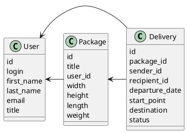

# Компонентная архитектура
<!-- Состав и взаимосвязи компонентов системы между собой и внешними системами с указанием протоколов, ключевые технологии, используемые для реализации компонентов.
Диаграмма контейнеров C4 и текстовое описание. 
-->
## Компонентная диаграмма

```plantuml
@startuml
!include https://raw.githubusercontent.com/plantuml-stdlib/C4-PlantUML/master/C4_Container.puml

AddElementTag("microService", $shape=EightSidedShape(), $bgColor="CornflowerBlue", $fontColor="white", $legendText="microservice")
AddElementTag("storage", $shape=RoundedBoxShape(), $bgColor="lightSkyBlue", $fontColor="white")

Person(admin, "Администратор")
Person(courer, "Курьер")
Person(user, "Пользователь")

System_Ext(web_site, "Клиентский веб-сайт", "HTML, CSS, JavaScript, React", "Веб-интерфейс")

System_Boundary(conference_site, "Сайт доставок") {
   'Container(web_site, "Клиентский веб-сайт", ")
   Container(client_service, "Сервис авторизации", "C++", "Сервис управления пользователями", $tags = "microService")    
   Container(package_service, "Сервис посылок", "C++", "Сервис управления посылками", $tags = "microService") 
   Container(delivery_service, "Сервис доставок", "C++", "Сервис управления доставками", $tags = "microService")   
   ContainerDb(db, "База данных", "Postgresql", "Хранение данных о посылках, доставках и пользователях", $tags = "storage")
   
}

Rel(admin, web_site, "Просмотр, добавление и редактирование информации о пользователях. Мониторинг посылок, доставок, помощь в случае ошибок")
Rel(courer, web_site, "Получение информации о доставке по получателю и отправлителю, обновление статуса доставки")
Rel(user, web_site, "Регистрация, создание посылок и получение информации, создание доставки")

Rel(web_site, client_service, "Работа с пользователями", "localhost/person")
Rel(client_service, db, "INSERT/SELECT/UPDATE", "SQL")

Rel(web_site, package_service, "Работа с посылками", "localhost/pres")
Rel(package_service, db, "INSERT/SELECT/UPDATE", "SQL")

Rel(web_site,delivery_service, "Работа с доставками", "localhost/conf")
Rel(delivery_service, db, "INSERT/SELECT/UPDATE", "SQL")

@enduml
```
## Список компонентов  

### Сервис авторизации
**API**:
-	Создание нового пользователя
      - входные параметры: login, пароль, имя, фамилия, email, обращение (г-н/г-жа)
      - выходные параметры: идентификатор пользователя
-	Поиск пользователя по логину
     - входные параметры:  login
     - выходные параметры: имя, фамилия, email, обращение (г-н/г-жа), идентификатор пользователя
-	Поиск пользователя по маске имени и фамилии
     - входные параметры: маска фамилии, маска имени
     - выходные параметры: login, имя, фамилия, email, обращение (г-н/г-жа), идентификатор пользователя

### Сервис посылок
**API**:
- Создание посылки
  - Входные параметры: название посылки, вес, габариты, идентификатор пользователя, создавшего посылку
  - Выходыне параметры: все переданные параметры, вместе с идентификатором посылки
- Получение посылок пользователя
  - Входные параметры: идентификатор пользователя
  - Выходные параметры: список посылок пользователя

### Сервис доставок
**API**:
- Создание доставки от пользователя к пользователю
  - Входные параметры: идентификатор отправителя, получателя и посылки, дата отправления
  - Выходные параметры: идентификатор доставки
- Получение информации о доставке по получателю
  - Входные параметры: идентификатор получателя
  - Выходные параметры: айди доставки, дата отправления и статус
- Получение информации о доставке по отправителю:
  - Входные параметры: идентификтор отправителя
  - Выходные параметры: айди доставки, дата отправления и статус
  

### Модель данных
